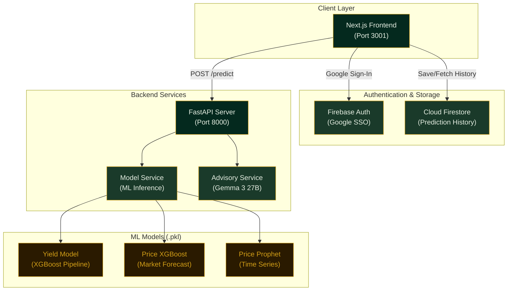
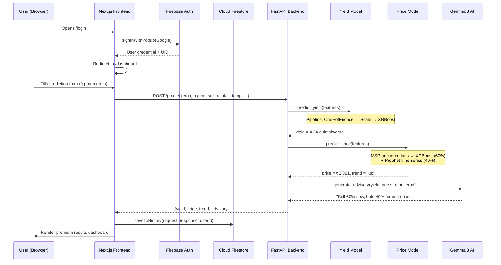
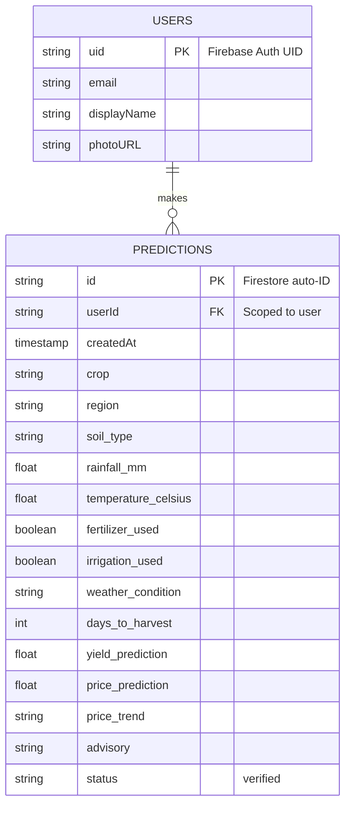

# AgriForecast — Product Report

> **Precision Agriculture Platform for Indian Farmers**
> Version 0.2.0 · March 2026

---

## 1. Executive Summary

**AgriForecast** is a full-stack AI-powered precision agriculture platform designed to help Indian farmers make data-driven decisions about crop yield expectations, market pricing, and optimal selling strategies. It combines machine learning inference (XGBoost, Prophet), real-time generative AI advisory (Google Gemma), and cloud-based data persistence (Firebase) into a single, premium "Deep Emerald & Gold" dashboard experience.

The platform accepts nine agronomic parameters — including crop type, region, soil conditions, rainfall, and temperature — and returns a three-part prediction: **estimated yield** (quintals/acre), **forecasted market price** (₹/quintal), and an **AI-generated selling recommendation**.

---

## 2. System Architecture

### 2.1 High-Level Architecture

### 2.2 Technology Stack

| Layer | Technology | Purpose |
|---|---|---|
| **Frontend** | Next.js 16.2 (Turbopack) | Server-side rendering, routing, premium UI |
| **Styling** | Tailwind CSS + Custom CSS Variables | "Deep Emerald & Gold" glass-morphism theme |
| **Auth** | Firebase Authentication | Google SSO via popup flow |
| **Database** | Cloud Firestore | User-scoped prediction history persistence |
| **Backend** | FastAPI + Uvicorn | RESTful ML inference API |
| **ML (Yield)** | scikit-learn Pipeline + XGBoost | Yield prediction with OneHotEncoding preprocessor |
| **ML (Price)** | XGBoost + Facebook Prophet | Ensemble price forecasting (60/40 blend) |
| **Advisory** | Google Gemma 3 27B (Generative AI) | Natural-language selling recommendations |

---

## 3. Prediction Pipeline — End-to-End Flow

### 3.1 Input Parameters

The user provides **nine agronomic features** through a guided three-step form:

| Step | Parameter | Type | Options |
|---|---|---|---|
| 01 — Foundational | Crop Type | Select | Maize, Rice, Barley, Wheat, Cotton, Soybean |
| 01 — Foundational | Soil Type | Select | Sandy, Loam, Chalky, Silt, Clay, Peaty |
| 01 — Foundational | Region | Select | North, South, West, East |
| 01 — Foundational | Days to Harvest | Slider | 10–250 days |
| 02 — Environment | Avg Rainfall (mm) | Numeric | Free input |
| 02 — Environment | Avg Temperature (°C) | Numeric | Free input |
| 02 — Environment | Weather Condition | Radio | Sunny, Rainy, Cloudy |
| 03 — Management | Irrigation Used | Radio | Automated / None |
| 03 — Management | Fertilizer Used | Radio | Synthetic / None |

### 3.2 ML Model Details

#### Yield Model (`yield_model.pkl`)
- **Type**: scikit-learn `Pipeline` wrapping an `XGBRegressor`
- **Preprocessing**: `ColumnTransformer` with:
  - `OneHotEncoder` for categorical features (Region, Soil_Type, Crop, Weather_Condition)
  - `FunctionTransformer` for boolean features (Fertilizer_Used, Irrigation_Used)
  - `StandardScaler` for numeric features (Rainfall_mm, Temperature_Celsius, Days_to_Harvest)
- **Output**: Predicted yield in **quintals/acre**

#### Price Model Ensemble (`price_xgb_all.pkl` + `price_prophet_all.pkl`)
- **XGBoost Regressor** — Takes 18 engineered features including crop encoding, price lags (7/14/30/60 day), rolling averages, momentum signals, MSP gap, and seasonal indicators
- **Facebook Prophet** — Time-series model providing trend-based forecasts
- **Ensemble Strategy**: `final_price = 0.6 × XGBoost + 0.4 × Prophet`
- **Anchoring**: Lag features are seeded using each crop's official **Minimum Support Price (MSP)**, ensuring crop-specific predictions (e.g., Cotton ≈ ₹6,700 vs Wheat ≈ ₹2,300)

---

## 4. Data & Persistence Architecture

- **Authentication**: Firebase Auth with Google Sign-In (popup flow). Auth state is managed client-side via Firebase listeners. All entry points (landing page, header CTA) redirect to `/login`.
- **History Storage**: Each prediction is persisted to the `predictions` Firestore collection, scoped by `userId`. Users can view their entire prediction timeline in the **Prediction History** tab, and download individual results as `.txt` reports.

---

## 5. Frontend — User Experience

The dashboard follows a **"Deep Emerald & Gold"** design language with glass-morphism panels, subtle micro-animations, and AI-generated aerial farm imagery. Key screens include:

| Screen | Path | Function |
|---|---|---|
| Landing Page | `/` | Marketing hero with CTA → Login |
| Login | `/login` | Google SSO authentication |
| Dashboard | `/dashboard` | Summary metrics, recent predictions |
| New Prediction | `/predict` | 3-step input form → Results |
| Prediction History | `/history` | Firestore-backed table of past predictions |
| Settings | `/settings` | User profile, sign-out |

### Key UX Features
- **Guided 3-Step Form**: Foundational Data → Environment → Active Management → Generate
- **Rich Result Cards**: Yield prediction with confidence score, market price with Mandi trend indicator
- **AI Advisory Panel**: Priority action card with natural-language selling recommendation
- **Download Report**: One-click `.txt` export of the full prediction result
- **Responsive Design**: Optimized glass-morphism panels with reduced `backdrop-filter` blur for smooth performance

---

## 6. Deployment & Repository

| Item | Detail |
|---|---|
| **Repository** | [github.com/rohanheg025-droid/AgriForecast](https://github.com/rohanheg025-droid/AgriForecast) |
| **Frontend** | `npx next dev -p 3001` (Turbopack) |
| **Backend** | `uvicorn backend.main:app --port 8000 --reload` |
| **Firebase Project** | `agriforecast01` |
| **Python Dependencies** | fastapi, uvicorn, pandas, joblib, xgboost, prophet, google-generativeai |
| **Node Dependencies** | next, react, firebase, lucide-react, tailwindcss |

---

> *AgriForecast — Empowering Indian farmers with satellite-grade AI predictions. Built March 2026.*
